# Getting Started
This guide contains instructions for basic course and project setup on autograder.io.
See the [How-to guide](./how_tos.md) for topics not covered here.

- [Create a Course](#create-a-course)
- [Configure the Course's Settings](#configure-the-course-s-settings)
  + [Fill the Roster](#fill-the-roster)
  + [Restrict guests to your email domain](#restrict-guests-to-your-email-domain)
  + [(Optional) Configure late day tokens](#-optional--configure-late-day-tokens)
- [Create a Project](#create-a-project)
- [Configure the Project's Settings](#configure-the-project-s-settings)
  + [Set Deadlines](#set-deadlines)
  + [Access Settings](#access-settings)
  + [Groups](#groups)
  + [Grading Policy](#grading-policy)
  + [Submission Limits](#submission-limits)
    - [Set the timezone for "Reset submissions per day at" to your local timezone.](#set-the-timezone-for--reset-submissions-per-day-at--to-your-local-timezone)
    - [Bonus submissions](#bonus-submissions)
- [Upload Instructor Files](#upload-instructor-files)
- [Configure Files Students Should Submit](#configure-files-students-should-submit)
- [Test Cases](#test-cases)
  + [1. Suites](#1-suites)
    - ["Deferred" Suites](#-deferred--suites)
  + [2. Test Cases](#2-test-cases)
  + [3. Commands](#3-commands)
    - [I/O Redirection and Diffing](#i-o-redirection-and-diffing)
    - [Resource Limits](#resource-limits)
    - [Feedback Settings](#feedback-settings)
    - [Feedback "Categories"](#feedback--categories-)
    - [Testing Your Feedback Settings](#testing-your-feedback-settings)
    - [Advanced Feedback Settings](#advanced-feedback-settings)
  + [Cloning test Cases](#cloning-test-cases)
- [Downloading Grades](#downloading-grades)

## Create a Course
If you are creating a course for the first time, contact `help@autograder.io` (or your system administrator if not running on autograder.io) for assistance.

To copy a course from a previous term, click the "copy" icon for the course you want to clone.

## Configure the Course's Settings
Click the gear icon for your new course to enter the course admin page.

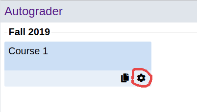

### Fill the Roster
Hover over the "Roster" tab and click on one of the roles listed in the dropdown menu. The roles are as follows:
- __Admin__: Admins have full edit permissions for the course. That includes changing user permissions, editing projects and test cases, etc. Admins can also look up students' submissions with any feedback level. Admins also have the same privileges as staff users.
- __Staff__: Staff can submit their own code unlimited times with maximum feedback. Staff can look up students' submissions, but with restricted feedback as configured by admins.
- __Student__: Students can view and submit to all published projects in the course. The can also form groups with other students (where allowed by the project settings).
- __Handgrader__: Handgraders can access the handgrading interface for projects in the course and therefore grade students' submissions according to a rubric configured by admins.
- __Guest__: Any user with none of the roles listed above is considered a guest. Guests can only access projects that are configured to allow guests, and can only form groups with other guests.

To add users to the roster you selected, paste a newline-separated list of email addresses into the text box and click "Add to Roster".

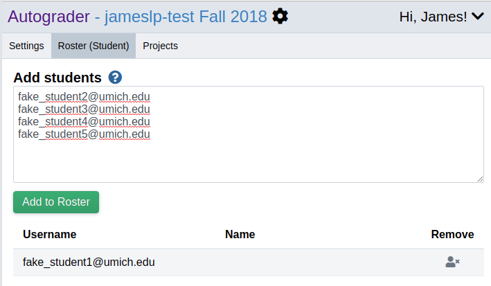

### Restrict guests to your email domain
Guests are users who are allowed to submit an assignment but are not in the roster for the course.
If your institution has a specific email domain (e.g. `@umich.edu`) we recommend setting the "Guest usernames must end with" field to that email domain.

<table style="border: 1px solid slategray">
    <tr><td></td></tr>
</table>

### (Optional) Configure late day tokens
_Note:_ Set this value __before__ publishing any projects.

If you set "Late day tokens" to a value other than zero, then each student in your course will be given that many tokens that can be used to continue submitting after a project's hard deadline (one day per token used). Tokens are used automatically when a student attemps to submit after the hard deadline (taking into account any extensions or late day tokens used already).

The tokens are given to students the first time their number of remaining late days is looked up in the database, so it's best to set this value before publishing any projects.

## Create a Project
On the course admin page, click on the Projects tab. Then enter the name for your new project and click "Add Project". You can also copy an existing project (optionally adding the new project to a different course you administer) by clicking the "copy" icon for that project.

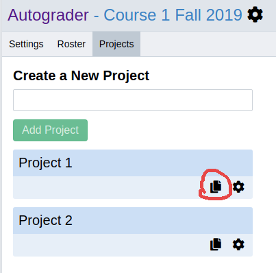

## Configure the Project's Settings
Click the gear icon for your new project to enter the project admin page.

### Set Deadlines
There are two deadline settings for projects:
- __Hard Deadline__: After this passes, __students will no longer be able to submit their code.__ Unlike the soft deadline, this value is __hidden from students and staff__. If late day tokens are allowed, submitting after this deadline will automatically use those tokens as appropriate.
- __Soft Deadline__: This is the deadline that is __shown to students__. It does NOT affect students' ability to submit their code and will not cause late day tokens to be used.

__Recommendations and Caveats__:
- We recommend setting the hard and soft deadlines close together, if not to the same value. For example, you could set the soft deadline to __8pm__ and the hard deadline to __8:06pm__. This can help make the deadline slightly less rigid and reduce the number of "I tried to submit at 8:01pm" emails while still making it feel like the deadline is actually at 8pm.
- The soft deadline will be used to provide a __hint to students__ that a late day token __might be used__ if they submit. For example, if the soft deadline is __8pm__ and the hard deadline is __8:05pm__, a submission at 8:01pm will NOT use a late day token, but a submission at 8:06pm will.

### [Access Settings]
- __Publish project__: Open the project to students for submitting.
- __Anyone with the link can submit__: Allow guests to submit. Guests can access the project using a direct link.
- __Disable submitting__: Temporarily prevent students from submitting, but keep the project visible.
- __Publish final grades__: Show students their final graded submission once these conditions have been met:
    - The hard deadline has passed
    - The student's extension (if any) has passed
    - The extra submission time granted by use of a late day token has passed

### Groups
To allow students to work together on a project, set the "Max group size" to a value greater than 1.
When groups are allowed, students will be prompted to form their group (or declare they are working alone) by sending and accepting an invitation the first time they go to the project page.

If you need to temporarily (or permanently) stop new groups from being formed, check the "Disable group registration" box. __NOTE__: This will also prevent individuals who have not declared that they are working alone from doing so and submitting.

### Grading Policy
Select whether to use students' most recent or best (counting all test cases) submission for their final score.

### Submission Limits
Here you can choose to limit the number of times an individual or group can submit per day.
Unless you override the default (by checking the "Groups get more submissions than individuals
" box), individuals and groups will get the same number of submissions per day.

Once you set a limit, you have two choices for how the limit is enforced:
- __A hard cutoff__: Students will not be able to submit for the rest of the day once they hit the submission limit.
- __A soft cutoff__: Students can continue to submit, but they will only see reduced feedback (as configured by admins) for those submissions.

For soft cutoff, check the "Allow submissions past limit" box. For a hard cutoff, uncheck it.

<table style="border: 1px solid slategray">
    <tr><td>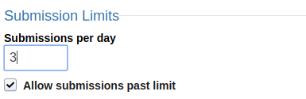</td></tr>
</table>

#### Set the timezone for "Reset submissions per day at" to your local timezone.

<table style="border: 1px solid slategray">
    <tr><td>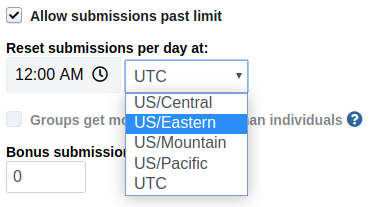</td></tr>
</table>

#### Bonus submissions
_Note:_ Groups and individuals are treated uniformly with respect to bonus submissions, so this section uses these terms interchangeably.

_Note:_ Set this value __before__ publishing the project.

If you set "Bonus submissions per group" to a value other than zero, then new groups (at the moment they are created) will be given that many "bonus submission" tokens. A bonus submission token can be used automatically to bypass the submission limit, regardless of whether a hard or soft cutoff is used.

## Upload Instructor Files
Click on the "__Instructor Files__" tab and upload any instructor-written files that are needed to run your test cases. This might include input files, expected output, headers and other libraries, etc.

Note: If you need to update an instructor file, simply upload it again and it will be updated in place.

## Configure Files Students Should Submit
Click on the "__Student Files__" tab and use the form to specify the names of files students should submit. You can specify an exact match, such as `spam.cpp` or a shell-style wildcard, such as `test_*.cpp`. See https://docs.python.org/3.5/library/fnmatch.html for a list of supported wildcard characters.

When students submit, they will be shown a warning if any files are missing or if they've included extra files. Students can ignore the warning and submit anyway if they wish. Extra files will be discarded by the server and recorded as such in the submission data.

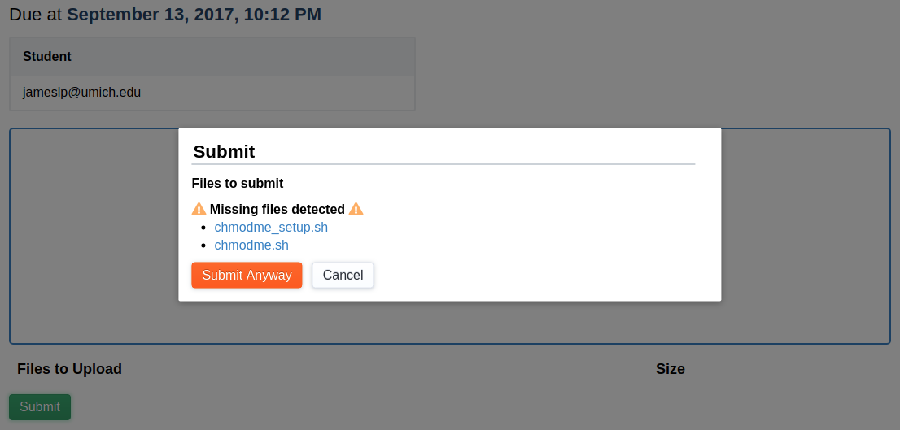

## Test Cases
Click on the "__Test Cases__" tab to start editing test cases. The 3 abstractions described here will help you customize how your tests are run.

### 1. Suites
A suite is a collection of test cases to be run sequentially in an isolated environment (a new environment is created per suite per submission). Suite settings are largely concerned with setting up the grading environment for the test cases.

Click the "Add Suite" to create a new test suite.

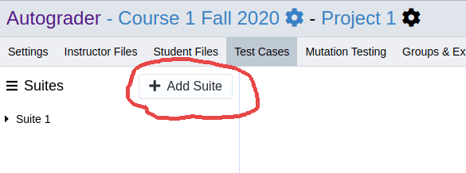

The most important settings for a suite are:
1. __Sandbox environment__: Specifies which environment (Docker image) the suite should be run in.
1. __Instructor Files and Student Files__: Specifies which files should be added to the grading environment. All files are added to the working directory of the environment. Instructor files are added after student files, therefore overwriting any student files with the same name.
1. __Setup command__: This command will be run once at the beginning of the suite. If your tests require an executable to be compiled, an archive extracted, or some other setup action, it should be part of this command.

__Note__: Commands can be (almost) any valid Bash command.

__CAVEAT__: The executable bit on instructor files is not preserved when they are copied into the grading environment. As such, running a script using `./script.bash` __will not work__. Instead, __invoke the interpreter directly__, as in: `bash script.bash` or `python3 script.py`. You will also find that trying to change the permissions with `chmod` will fail, as instructor files are marked as read-only and owned by root to prevent student code from modifying them.

#### "Deferred" Suites
If you uncheck the "Suite must finish before students can submit again" box, then the suite will be considered "deferred." Deferred suites run in a separate queue and therefore may take longer to be graded. However, students don't have to wait for these suites to finish before they are allowed to submit again. This option is useful for suites of hidden test cases that students don't see until after the deadline.

### 2. Test Cases
In the "Suites" sidebar, hover over the name of the suite you want to add a test to and click the plus icon.

A collection of one or more commands. When a test case has only one command, the editing interface will merge this layer with the "command" layer. Although test cases do offer some of their own feedback settings, these are rarely used.

The score for a test case __will not go below zero__. If a students score would go below zero, it is set to zero instead. Tests with multiple commands can take advantage of this by __awarding points for some commands passing__ and __deducting points for some commands failing__.

### 3. Commands
New test cases automatically and transparently contain one command.

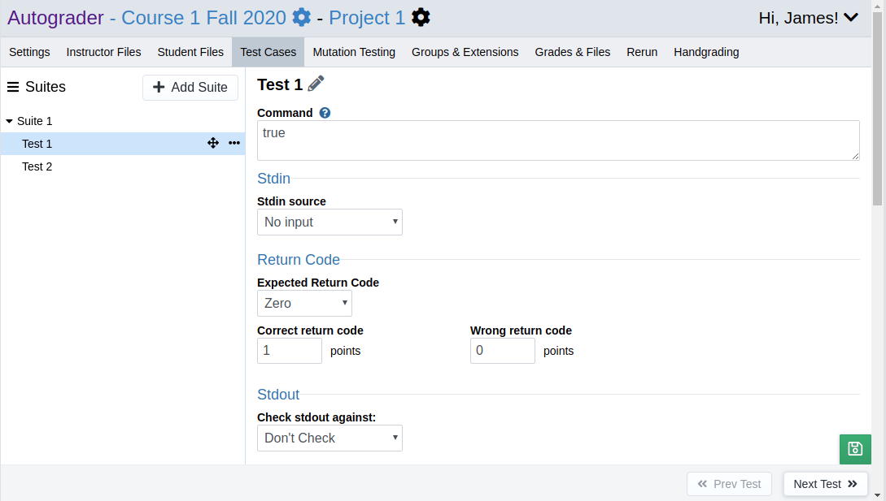

Commands hold the details for how a test case should be run. For example:
- The actual Bash command to be run.
- Whether to pipe some text or a file to stdin of the command.
- What it means for the command to be "correct", e.g.:
    - Whether it should exit zero or nonzero
    - The expected output for stdout and/or stderr
- How to assign points for a correct or incorrect command. It is possible to set up a command so that it awards points for, say, the return code being correct and deducts points for say, stdout being incorrect.
    - A common use case for deducting points is when using a tool such as Valgrind to check for memory leaks. One command can run the program without Valgrind, and a second command can run it with Valgrind and deduct points if Valgrind exits nonzero.

#### I/O Redirection and Diffing
To help avoid leaking test case information, you can configure input to be redirected from and/or output to be compared directly against an instructor file ___without adding that file to the grading environment___ (files selected under "Instructor Files Needed" in the suite settings are added to the grading environment).
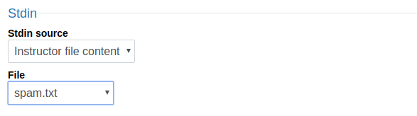

Similarly, you can configure the command output to be compared directly against an instructor file.
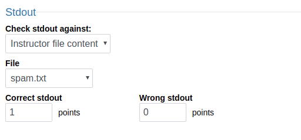

If your I/O is very short, you can instead choose to enter it as text:
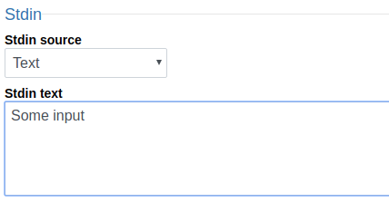

#### Resource Limits
For some simple programs, the default resource limits will be sufficient. Other programs, such as Java, Bash, or Octave (Matlab), will require __increasing the process spawn and virtual memory limits__.

For Java and Octave programs, 2000000000 bytes (2GB) and 16 processes is usually sufficient.

For Bash scrips or other programs that spawn subprocesses, 10 is usually sufficient. The process spawn limit can be increased as high as 150 processes.

#### Feedback Settings
Feedback is highly customizable. In most cases, you will only need to change the preset for "Normal" feedback for your tests:
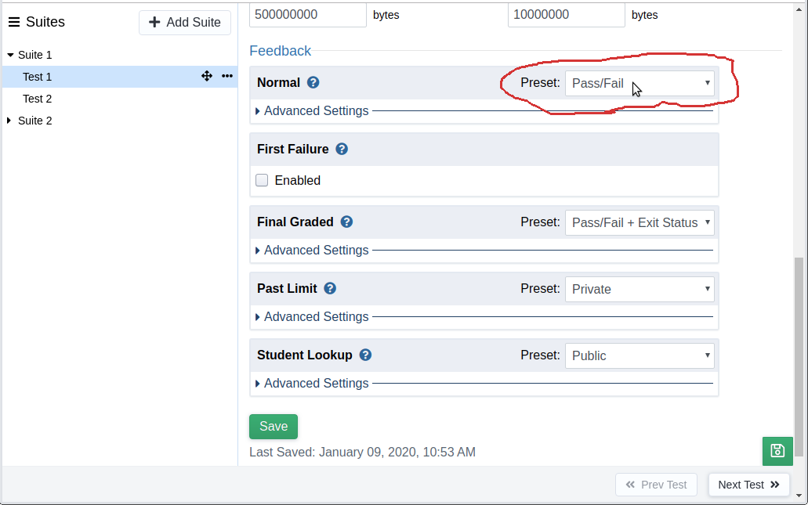

#### Feedback "Categories"
For specific information on feedback categories, please refer to the tooltips associated with each category.

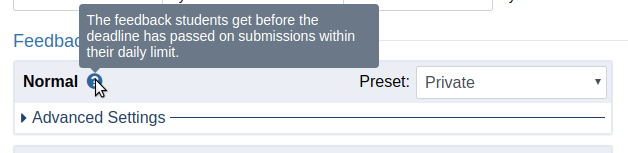

Here are some useful tips about feedback categories:
- Admins can control the feedback students see depending on whether the submission in question is the student's final graded submission or a submission past the student's daily limit.
    - Note: Students will not receive final graded submission feedback unless the conditions listed under "Publish final grades" in [Access Settings](#access-settings) have been met.
- Admins can control what staff see when looking up student submissions by changing the "Student Lookup" settings.

#### Testing Your Feedback Settings
Once you've saved your feedback settings, you can inspect them on one of your own submissions.
Go to the the "My Submissions" tab in the project page, and then select the feedback category you wish to inspect using the "Adjuct Feedback" dropdown:
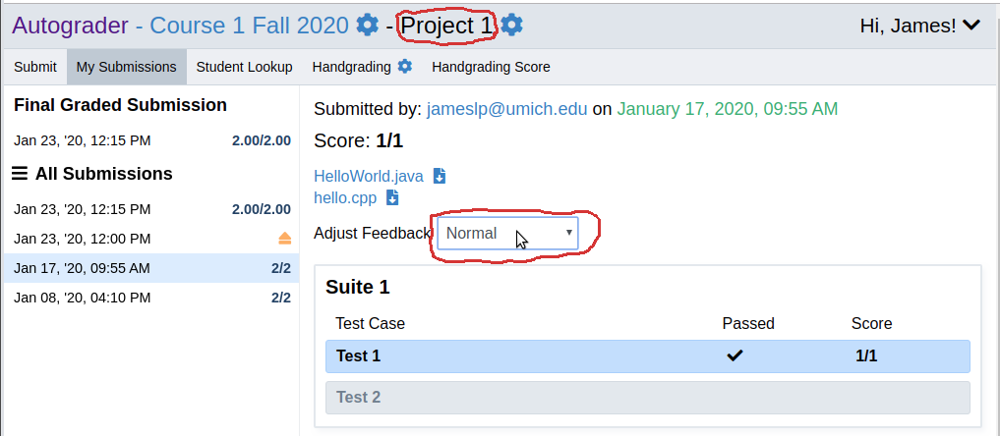

#### Advanced Feedback Settings
If none of the feedback presets match your needs, you can adjust settings individually by
clicking on "Advanced Settings":
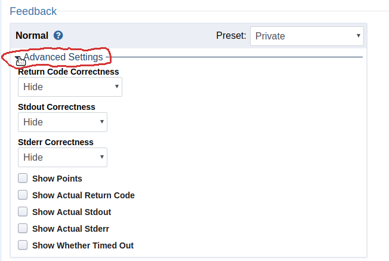

### Cloning test Cases
Test cases within the same suite often have

## Downloading Grades
Under the "__Grades & Files__" tab you can download a csv file containing project scores (including handgrading, if applicable) or a zip archive containing student files. Select your desired options and click "__Start task__". A download link will appear once your csv or zip file is ready.
